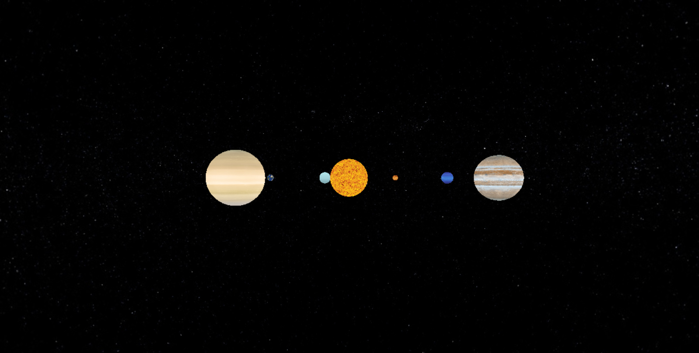
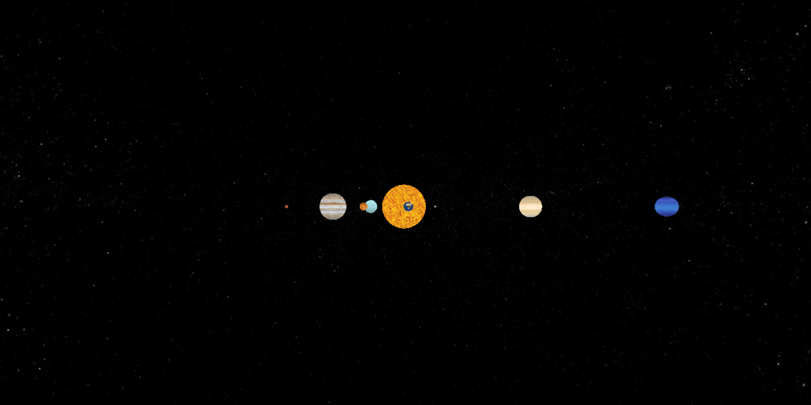
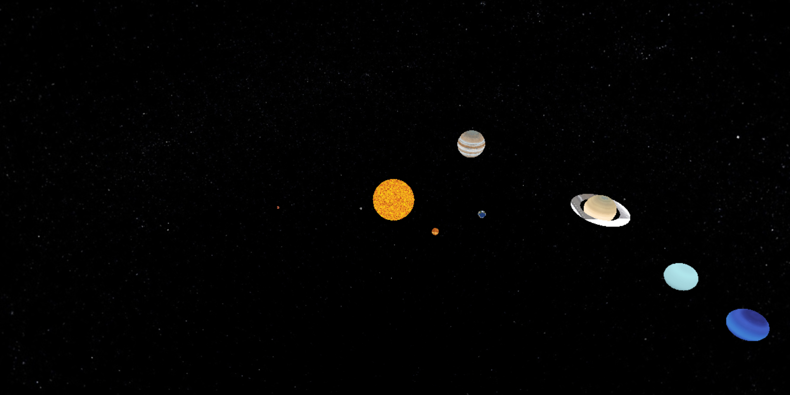
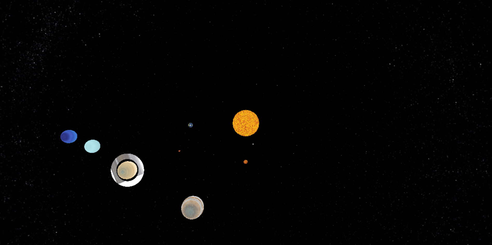

# SolarSystemAnimation
This program uses openGL to demonstrate the planets in our solar system rotating around the sun.

Here is the link to the textures used for the planets and sun:
https://drive.google.com/file/d/1hMRdA68C8y6YDlqWzn0iaVe-t2x86dij/view?usp=sharing

To have the textures visible when running the program, you have to edit the paths in the code
so that they lead to the desired texture on your device.

*NOTE*
Saturn's rings currently not textured correctly.

Here are a few images of what your output should look like.

Front View

Side View

Perspective View

Top View

